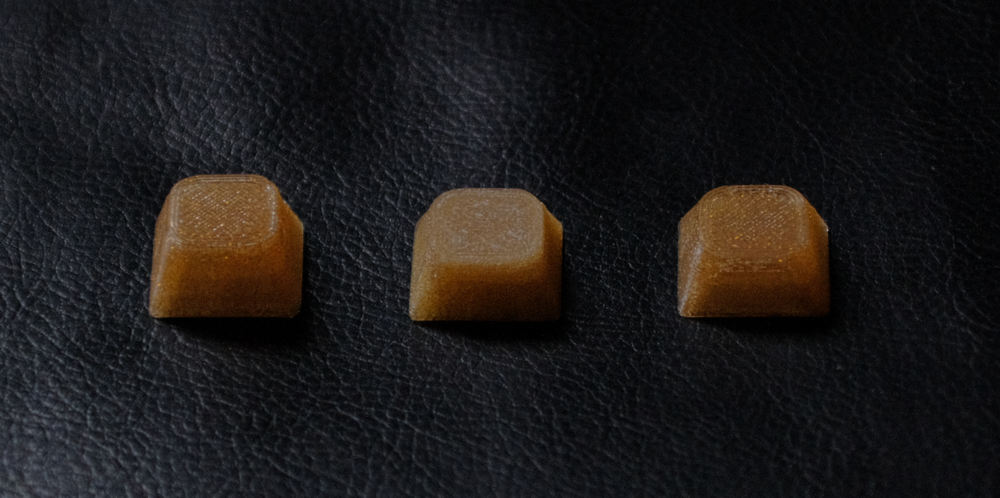
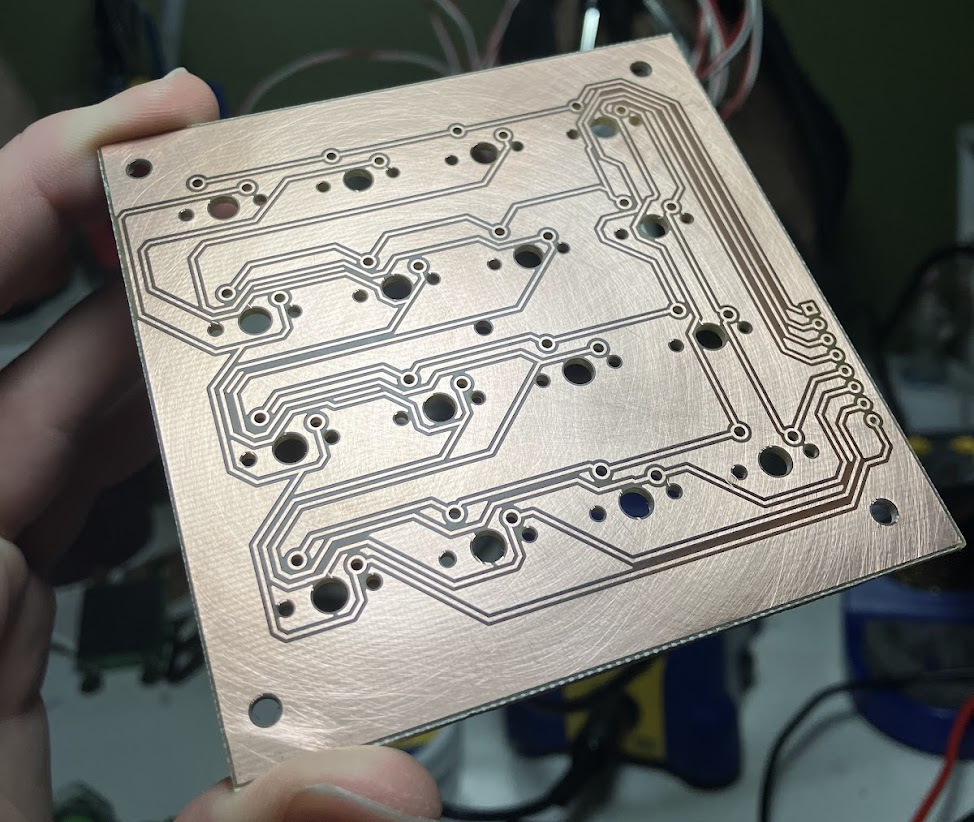
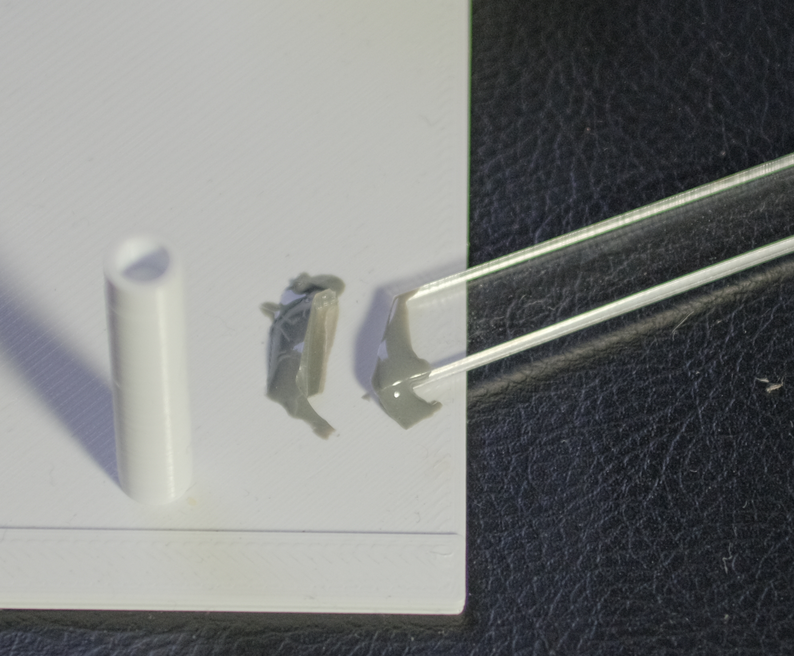
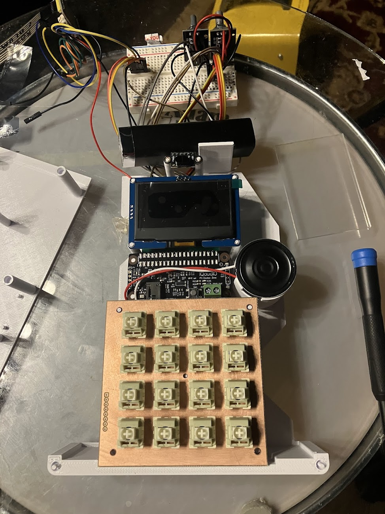
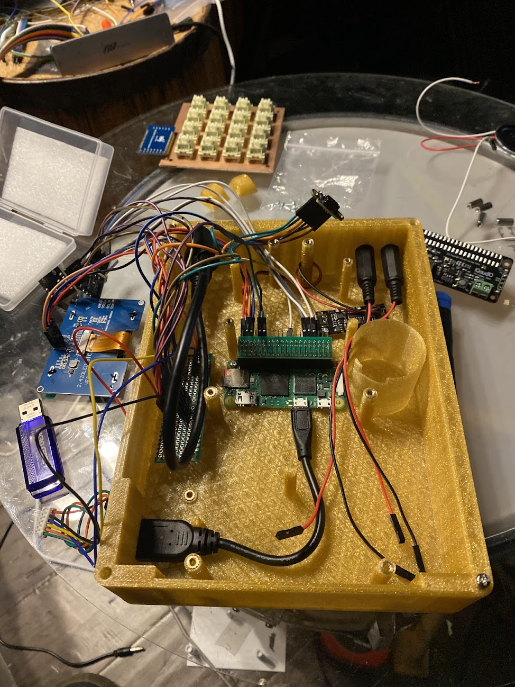

# The Chrustler
  Chrustler is a combination of the words 'chord' (what the instrument plays) 'Rust' (the language the software is written in) and 'sampler' (the family of instruments it belongs to). This instrument takes in samples recorded using the device or loaded from a USB drive and detects their frequency. Then the user can play that sample as chords in one of the western music scales. This is my final project for CS3651 at Georgia Tech.
## Hardware
  1. Brains: Raspbery Pi Zero 2 W  
    - Runs the software itself.
  2. I2S audio card: IQuadIO Codec Zero  
    - Used for internal mic and speaker, AUX in and out headers.
    - Also has a 5 band EQ used for the high and low pass filters.
  3. Display: SSD1309 I2C (128x64 2.5in OLED)  
    - Displays current playback information.
  4. Time of Flight sensor: ST Micro VL53L1X  
    - Has 2 regions of interest where the right side controls the level of the high frequencies (low pass filter), and the left side controls the level of the low frequencies (high pass filter)
  5. MCP23017 GPIO extender  
    - Provides additional GPIO for keypad input.
  5. PD Trigger Board  
    - Takes USB-C PD and turns it into 5V to power everything.
  6. USB-C “flush” mount extension  
    - This is intended for installation in a car to add a USB-C port, but provides a way to panel mount the power input (and USB-C is better than micro-B on the pi).
  7. 2x 3.5mm TRS female jacks  
    - Connected to the AUX in and out headers on the Codec Zero for external audio IO.
  8. Micro USB OTG cable  
    - Used to expose a full size USB port for portable loading and storing of sample files.
  9. 1W 8ohm 3.6cm speaker  
    - Connected to the Codec Zero as the internal speaker.
  10. Proto-board  
    - Used for a 5V and ground buses as well as I2C data and clock buses.
  11. Custom PCB for 4x4 Cherry-style mechanical key switches  
    - Designed in KiCAD and manufactured at the GT Hive to hold 16 cherry-style switches and the MCP23017.  
    - The KiCAD project and board drawings are in [/keypad_pcb/](/keypad_pcb/)  
  12. 16x Otemu Lemon switches  
    - Spare linear Cherry-style switches I had that felt nice for the primary input method.  
  13. 2x Addicore AD267 Rotary Encoders (from class kit)  
    - Included in parts kit for class and used for volume adjustment, IO change, key change, and sample selection.  
  14. 1-2 GPIO duplication module  
    - Gives one set of 40 GPIO pins to connect to the Codec Zero, and another for the other GPIO devices, I2C, and power.  
  15. 8x m2.5 screws & heat set inserts
  16. 12x m3 screws & heat set inserts
  17. 3D printed Chassis  
    - Housing with standoffs to add heat-set inserts, and mount everything nicely. Designed in OpenSCAD.
  18. 3D printed faceplate with acrylic window  
    - Covers the main chassis and has inset text to identify IO ports, Encoder functions, and internal microphone location. Designed in OpenSCAD.  
    - The file for the chassis and faceplate is at [scad/chrustler chassis.scad](scad/crustler%20chassis.scad).  
  19. 2x 3D printed standoffs  
    - used to support the Codec Zero on top of the Pi accounting for the height added by the GPIO duplicator. Designed in OpenSCAD.  
    - File is at [scad/soundcard standoff.scad](scad/soundcard%20standoff.scad)  
  20. 16x 3D printed keycaps  
    - Custom 3D printed keycaps with the appropriate legends built from the [keycap playground OpenSCAD repo](https://github.com/riskable/keycap_playground).  
    - My modified version of the keycap plaground file is at [/scad/keycap_playground/keycap_playground.scad](/scad/keycap_playground/keycap_playground.scad). This was used to make a base stl file, and then imported to [/scad/legend_caps.scad](/scad/legend_caps.scad) to add the legends.
  21. 2x encoder caps  
    - Spares I had from an SP404-OG after replacing them on that device.

## Libraries
  I wanted to write the software in Rust from the start and it provides a nice way to handle interrupts/multithreading, errors, and has pretty good library support on Raspberry Pi devices. I used Rust's standard library, and a couple of other common ones such as `serde` for storing the time of flight sensor's calibration data. The libraries of note that are used to interact with the hardware are:
  1. [pitch-detection](https://docs.rs/pitch-detection/latest/pitch_detection/)  
    - Provides a function for detecting the audio frequency on an array of individual sample points from an audio file.
  1. [awedio](https://docs.rs/awedio/latest/awedio/index.html)  
    - This library handles the playback of samples and provides functions to adjust the speed of the sample (very important for pitch correction) as well as a controller to stop/gate the playing samples.  
    - During development I kept running into an integer overflow issue when playing long samples. To fix this I changed a bunch of the related variables from unsigned 32 bit to unsigned 64 bit numbers.  
    - [My fork](https://github.com/CharlliePhillips/awedio64)
  2. [vl53l1x-rs](https://docs.rs/vl53l1x/latest/vl53l1x/)  
    - This library provides functions for the time of flight sensor.  
    - This nor any other 3rd party library I could find supported all five calibration functions, and so I added wrappers to the ST Micro API for them.  
    - Additionally the `usleep()` function in the ST Micro library this crate wraps wasn't compiling on the Pi, so I changed it to `nanosleep()`.  
    - [My fork](https://github.com/CharlliePhillips/vl53l1x-rs)
  3. [rppal](https://docs.rs/rppal/latest/rppal/)  
    - Provides functions to access the GPIO and I2C hardware on the Pi.
  4. [mcp23017](https://docs.rs/mcp23017/latest/mcp23017/)  
    - Provides functions to interface with GPIO on the MCP23017.
  5. [ssd1306](https://docs.rs/ssd1306/latest/ssd1306/)  
    - Provides structures and functions to interface with an SSD1306 display.  
    - The SSD1306 display is identical to the SSD1309 display used for this project (aside from the physical size, and default address), and by changing the I2C address provided during initialization is cross-compatible.
  6. [embedded-graphics](https://docs.rs/embedded-graphics/latest/embedded_graphics/)  
    - Provides structures and functions for creating the text shown on the display.  

  - The libraries' documentation is linked where their git repos can also be found.

  - I also used the [BOSL2](https://github.com/BelfrySCAD/BOSL2) OpenSCAD library for making cubes with rounded corners.
## Learned Skills
  1. Time of Flight Sensors  
    - Before taking on this project I was totally unaware that this type of distance sensor existed. I had originally intended to use an ultrasonic sensor, or a more traditional IR sensor.  
    - I picked the model of ToF sensor I did because of it's existing Rust library support, and the user programmable Regions of interest. Those regions of interest will still pick up on objects outside the region of interest if they cover enough of the sensor's field of view but work reasonably well with two hands at different distances.  
    - It is pretty easy to interface with the sensor over I2C but they do not come calibrated from the factory and must go through a 3-step calibration process in order to get accurate readings that properly distinguish between the regions of interest.  
      1. SPAD - This is calibrated at the factory but without a cover glass that I used on my prototype. It selects the best of the sub-sensors on the device to use.  
      2. Offset - The device being soldered down and added cover class can introduce an offset in distance readings, this measures and corrects for that.  
      3. Cross-talk - The cover glass can cause some of the light emitted to bounce back into the sensor prematurely. This step compensates for that.  
  2. Heat set inserts (talk about borked one)  
    - I was familiar with this process before but had never done it myself. Getting the holes for the inserts correct took some trial and error, and when it came to insert some for testing I found that making a hole bigger with a soldering iron while the insert is half-inserted is a quick way to get plastic stuck in the insert and make it unusable.
  3. Multi-color 3D printing  
    - I had only done single-colored prints before and OpenSCAD has support for color, but it will not export those colors with STL files. In order to add color I created a small indent in the parts that the Bambu slicer would not recognize as a seperate layer, and then used the color painting/fill tool with edge detection to color the text.  
    - I also found that printing the "base" color before the text caused it to come out messy and distorted. When the text is printed before the rest of each layer though, it comes out crisp and very nice looking.  
    - Example of printing the base color before the text:  
      
    - Printing the parts face down (with the text on the bottom layers) also gives the final product a clean, textured finish.
  4. Iterating on CAD designs  
    - The core part of the chassis has a lot of pretty precise measurements to hold everything in place. Instead of re-printing the entire base (10+ hours) each time I had to make an adjustment, I printed skeletons and small sections of the part to make sure everything fit.  
    - This was also useful for getting the sizing of the keycaps correct given that I'm using a non-standard plate.  
    - The following photos go left to right, top to bottom for first iterations to most recent:  
      - Main Chassis Skeleton:  
      
      - IO Panel:  
      
      - USB panel and restraint:  
      
      - Keycaps:  
      
  5. Linux audio  
    - I've used Linux for quite some time to do multimedia work (always requires some fidling), but I haven't had to get in the weeds quite like this before.  
    - The volume, filter and adjustments along with the IO toggle both use `amixer` commands issued by the Rust program to change the relevant settings. This was easy to test using the `alsamixer` TUI and then translate into commands using the indices given by `amixer -c -1 controls`.  
    - I used `arecord` commands issued by the Rust program to do the audio recording as the simplest Rust interfaces for this were overcomplicated for my use case. When testing recording and playback in the final program I ran into a weird issue with lots of noise in the recordings from the program that didn't exist using the commands by themselves. After some troubleshooting I discovered that the audio device was opened in 32 bit PCM mode by the `awedio` library but I was recording in 16 bit mode as that is the actual format used by the library. Switching the recordings to 32 bit mode fixed this issue.
  6. PCB Fabrication  
    - To have a "macro" pad with Cherry-style switches that fit in the small size I wanted for the enclosure I had to design my own.  
    - Picking up KiCAD to recreate the simple circuit from the membrane pad given in our class kits was fairly easy, and a lot of resources exist online from the custom keyboards community to quickly get a model running. There was also a fellow student familiar with the process who was able to give me some design tips to make sure that my first run of the board would work, and be my last.  
    - The Hive makerspace at school had excellent documentation on using their PCB fabrication equipment (LPKF ProtoMat S103, and ProtoLaser U4). From there it was fairly easy to get everything going, and once finished then I was able to solder the switches and MCP23017 using my own equipment.  
    - The underside of the keypad PCB (the top side is just plain copper):  
    
  7. Acrylic Crazing and I2C Speed/Capacitance Relationship  
    - These two weren't part of skill demos for the class but my instructor Scott taught me about these when I was curious about some of these finer details.  
    - Securing acrylic with the right adhesive is important, as many adhesives will cause stress on top of that introduced by laser cutting. This additional stress can cause micro-cracks called "crazing" and is caused by adhesives with solvents like alcohol. To demo this he sprayed some dry erase fluid on an some laser cut acrylic scrap, and cracks started to form in less than a minute.  
    - I had some extra JB weld and thought that might work well so I used it on another piece of acrylic scrap and attached it to the first chassis skeleton (but it broke during stress testing):  
    
    - I was worried about cramming too much near the I2C bus circuitry and causing interference. I2C operates at a constant clock but the data experiences some curve in the rise time of the signals. Scott explained how this curve is dictated by the capacitance of the wires which ensured me that I didn't have to be too careful about where to place these signal wires inside of the enclosure.  
## Iteration Process
### Initial Testing
  1. Proof of Concept Program.  
    - My first work on this project was a simple program that recorded a sample, then corrected the pitch it and played back as a C-Major triad.  
    - Once I had acquired some of the hardware for the prototype I added the time of flight sensor readings to adjust a filter on this chord as it looped indefinitely.  
    - [Repo for this test](https://github.com/CharlliePhillips/crustler_poc)
  2. GPIO Test Program   
    - I also created a separate test program to hook up the remainder of the input hardware to to figure out a good setup for reading everything but the TOF sensor.  
    - [Repo for this test](https://github.com/CharlliePhillips/chrustler_btn_test)
  3. Testing Breadboard
    - For these test programs and much of the development of the main program I had all of the hardware connected to a breadboard. This made it easy to disconnect things to take measurements for the chassis while still working on the main program, and experiment minimizing the wires needed to connect everything.  
    - Having everything on the breadboard made it easy to hook up parts to the chassis skeleton(s):
    
### Ideas That Didn't Work Out
  1. Battery Power  
    - I had initially planned to add battery power to the device for portability. As I worked on the physical design and test fit the rest of the hardware I realized that there would not be a whole lot of room for the battery, and given the time constraint on the project decided that it could do without and USB-C PD would suffice.  
  2. Filter frequency sweeping  
    - I originally wanted to have the TOF sensor control both the frequency and intensity of the filters with a multi-zone sensor where the frequency would be set by the zone(s) and intensity controlled by the distance, but with poor documentation and 3rd party library support this was out of reach.  
    - When moving to a ROI sensor instead of multi-region one I had instead wanted a fixed intensity where the distance controlled the frequency, but I then found that the audio card I had decided on has a built in 5 band EQ, but it is not parametric.  
    - I finally landed on the distance controlling the intensity of the lower two and upper two frequency bands provided by the built in EQ. The intensity of the "inner" band of each side is halved from the intensity set to the highest and lowest end of the EQ, and this works fairly well as a high, low, or band pass filter.
### Hardware That Had To Be Changed
  1. Keypad
    - As alluded to before I originally was using a 4x4 membrane keypad as the primary input for the device. This really sucked,  it was hard to tell when I was pressing the button or not, and it was very small making it a little hard to play multiple chords in succession.
    - This shows how small the original pad was compared to the one I made:  
    
    - Creating my own keypad fixed these problems, and also let me change the legends on the keys for a more intuitive arrangement of the inputs.  
  2. SD Card – OTG adapter
    - My original idea for loading external sound files was to use an SD card like on devices like the SP404 MKII and modern (or modernized) MPC devices. This is sort of what the format is intended for, but requires an SPI connection from the limited GPIO I had after adding the sound card.  
    - To simplify things I decided to mount a micro-B OTG adapter inside of the device that connects directly to the Raspberry Pi. This let me focus on getting the file navigation part of my code working correctly and should theoretically not be too difficult if I were to add it in the future.  
### Lessons Learned
  1. Calibrate Your ToF Sensor    
    - Before calibration the ToF sensor readings where all over the place. Adding the Rust calibration functions to the library I used and sitting through the calibration process was something I should have considered from the start and was absolutely worth it.
  2. Consider cable management  
    - Despite not needing to be too worried about I2C interference I should have spent some more time considering where to route all of the wires inside of the device. It is a bit of a rats nest, and with a little more thought, I think I could do much better.  
  3. Test Physical Design With Small Parts   
    - The 3D print iterations shown above were key to getting my physical design just right.  
    - I hadn't taken on a 3D modeling and design project of this scale before, and had never needed to do more than a couple of full prints to get something the way I wanted. I was still pretty uncertain about my measurements at each stage and printing only the parts I was concerned about saved me a lot of time and filament.  
  4. ALSA(mixer) is fun  
    - Using the ALSA programs that come with Raspbian Linux (and most desktop Linux distros) made a lot of things I was uncertain about programming much easier than anticipated.  
    - If I ever do other audio-intense programming projects I will be considering some of these same techniques to make my life easier. I know this is sorta the "Unix Philosophy" but often times built in programs don't come with quite everything I want them to, and this was not the case here.
  #### Other Potential Improvements
  1. More thorough recording (i.e. adjustable count in, timed recording, input level)  
    - Other sampler instruments offer these sorts of things, and they could be useful here as well.
  2. Simple sample trimming  
    - This would mean you don't have to start playing your recording as soon as or before the recording starts, and would be a very nice qol feature.
  3. Analog Chord Keys  
    - Using optical or hall-effect analog mechanical keyboard switches could be a nice way to keep the same form factor while adding velocity to the input. This would require a more complex PCB though and those switches are much harder to come by.
  4. Stereo sound  
    - All of the sound on this device is mono, and the audio IO is all wired as mono. This was to reduce possibilities while programming and still sounds great (especially for a prototype), but stereo is the standard and would improve the quality of the sound produced.

## The Final Prototype
A photo taken during assembly:

Overview of the final prototype:

Main IO panel on the final prototype:

USB Panel on the prototype:
 
